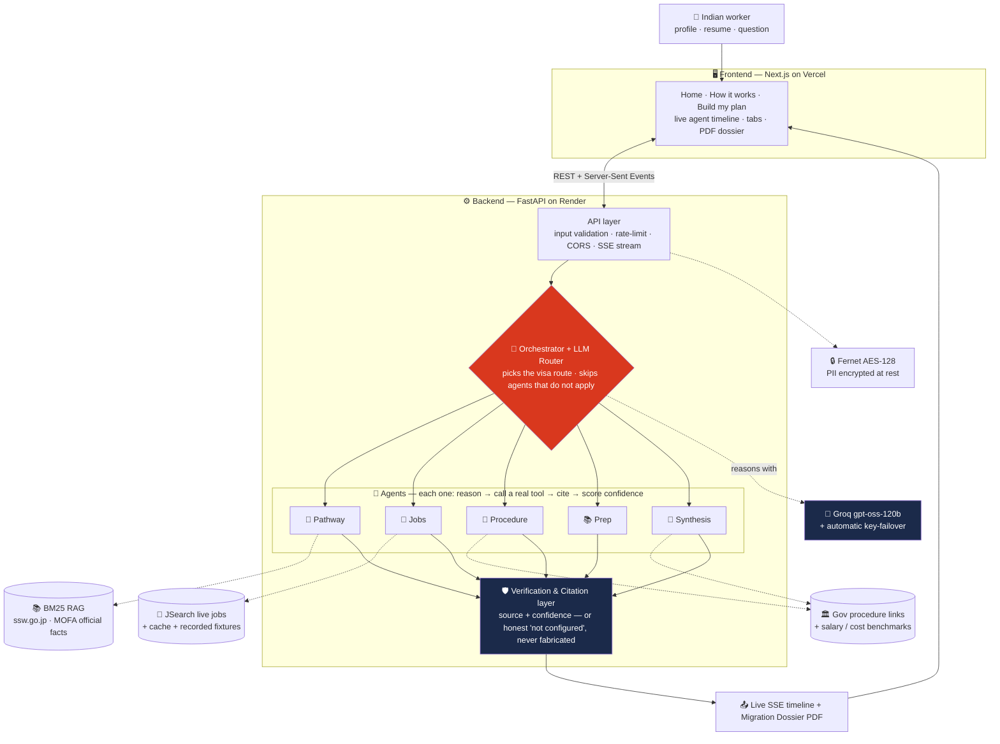
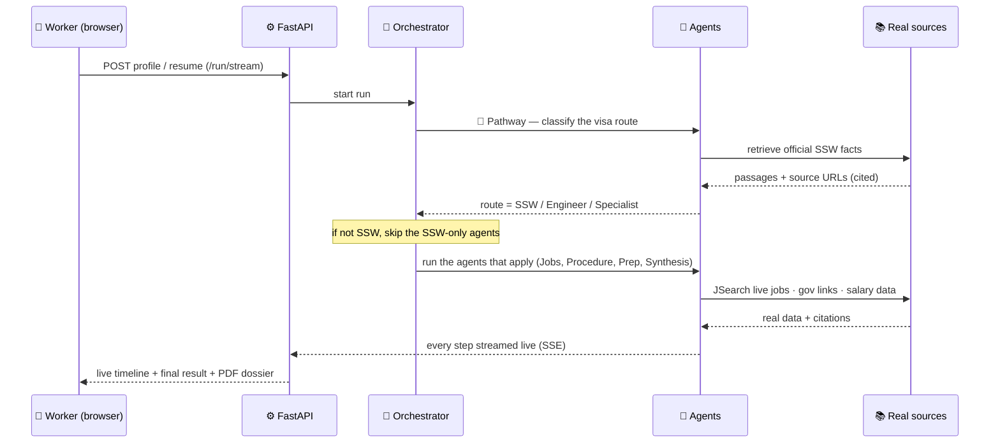

# 🌉 Kakehashi — Architecture

This is how the system actually works. The goal of the design is simple: **be real, be honest, and prove it.**

## The 5 rules we built by

1. **Real or nothing.** Every fact comes from a real API or a cited official document. A tool with no key returns "not configured" — it can never make something up.
2. **Prove it, don't claim it.** We *measure* how accurate the system is (grounded vs. ungrounded), instead of just saying it's good.
3. **The brain is separate from the screen.** All the intelligence lives in plain Python (`core/`). The website is a thin layer on top that we could swap out.
4. **It adapts to the person.** The orchestrator changes the plan for each user — for example, it routes IT and office workers off the SSW path to the correct visa.
5. **Private by design.** As little personal data as possible, encrypted when stored, secrets never in the code.

---

## The big picture



---

## What happens during one run (step by step)



1. The **Build my plan** page sends your profile to the backend's `/run/stream`.
2. The backend runs the agents in order. Every reasoning step is **streamed live** to the browser (Server-Sent Events) — that's the "Agents at work" timeline you see.
3. **Pathway** decides your visa route. If it's not SSW, the orchestrator **skips** the SSW-only agents and shows them as "skipped."
4. The remaining agents run. Each returns data, **citations**, and a confidence score. **Synthesis** writes the friendly overview.
5. A final event delivers the structured result; the website shows it in tabs.

---

## The folders

```
frontend/   Next.js 14 (App Router) · TypeScript · Tailwind · Framer Motion · Recharts
  app/         /  (landing)  ·  /how  (the story)  ·  /app  (the tool)
  components/  Nav · Hero · IntakeForm · AgentTimeline · Results (tabs) · ProofDashboard
  lib/         API client (REST + SSE), shared types

api/        FastAPI
  main.py      /run · /run/stream (live SSE) · /eval · /chat · /resume · /dossier · /save · /plan/{id} · /health
  middleware.py  per-IP rate limiting

core/       the brain (plain Python, no UI)
  engine.py        runs the agents in order; ADAPTS (skips SSW-only agents off-route); scores grounding
  agents/          pathway · jobs · procedure · prep · journey · synthesis
                   (base.py = the agent contract: reason → call tool → cite → confidence)
  tools/           real-data clients (jobs · e-Stat · flights) + cache + recorded fixtures
  rag/             official SSW facts; BM25 search; every passage carries a citation
  eval/            the gold checklist + grounded-vs-ungrounded proof
  llm.py           Groq client with automatic key-failover
  chat.py          grounded follow-up Q&A
  knowledge_pack.py  sectors · procedure steps (real links) · study resources · fees · salaries · routing
  security/        Fernet (AES) encryption-at-rest

config.py   loads keys from .env / env; honest "not configured" when a key is missing
```

---

## The agents

| Agent | What it figures out | Real source | What it returns |
|---|---|---|---|
| 🧭 Pathway | Is this person eligible, and for which visa? | SSW facts (RAG) | verdict, readiness %, gaps, sectors — cited |
| 💼 Jobs | Which real openings actually fit them? | JSearch (live) | listings ranked by fit % |
| 📄 Procedure | What are the official steps, in order? | SSW facts + knowledge pack | 6 steps, each with a real gov link |
| 📚 Prep | What language / skills gaps to close? | official test info | a study plan + free resources |
| 🗓️ Journey | Cost and timeline of moving | Amadeus | flights (roadmap) |
| 🧩 Synthesis | The whole picture in plain words | gov salary data | overview + salary + cost |

---

## How we keep it grounded (and prove it)

- Agents answer **only** from the official passages they retrieved, and attach the **source URL** to each claim.
- `core/eval/harness.py` runs the same question **grounded** (our agents) and **ungrounded** (a plain LLM), then an LLM judge scores both against a gold set of official facts → accuracy + a count of contradictions. That's the **Proof** tab. Full method and numbers: **[PROOF.md](PROOF.md)**.

## Security

- Secrets come from `.env` / environment (never committed). The LLM client uses a **backup key** automatically if the first hits its rate limit.
- `/plan/{id}` checks the id against `^[A-Za-z0-9_-]{6,24}$` to block path-traversal tricks.
- Saved plans are encrypted with Fernet when `FERNET_KEY` is set. No personal data in logs.

## Tech

Next.js 14 · FastAPI · **Groq `gpt-oss-120b`** (multilingual) · BM25 (`rank-bm25`) · `cryptography` (Fernet) · Recharts.

## Live now vs. roadmap

**Live:** Pathway · Jobs (real) · Procedure · Prep · Synthesis · Chat · Proof · save/share · PDF · EN/HI/JA · adaptive routing.
**Roadmap:** Amadeus flights (paid tier) · e-Stat demand charts · recruiter-scam detector · WhatsApp channel.
