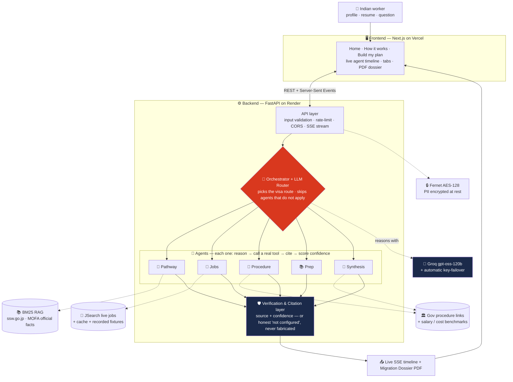
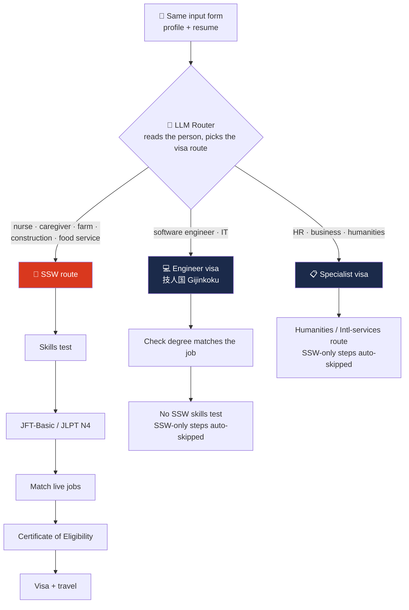
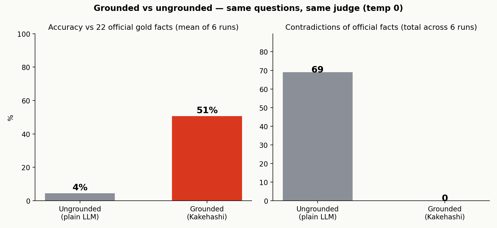

<div align="center">

# 🌉 Kakehashi · 架け橋

### An autonomous AI that helps Indian workers move to Japan — the honest way.

[](https://kakehashi-liard.vercel.app/)
[](https://far-away-hackthon.onrender.com)

**FAR AWAY 2026 — Theme: Agentic & Autonomous Systems**

`Real data, never fake` · `Every answer cited` · `Proven with numbers` · `English / हिन्दी / 日本語`

<br/>


<br/>

</div>

---

## Try it now

| | Link |
|---|---|
| 🚀 **Live app** | **https://kakehashi-liard.vercel.app/** |
| ⚙️ **Live API** | **https://far-away-hackthon.onrender.com** |
| 🎬 **Demo video** | _see the [video section](#-demo-video) below_ |
| 💻 **Code** | you're here |

> ⏳ The API runs on Render's **free tier, so it sleeps when idle**. The first request can take **~30–50 seconds to wake up**. Tip: open the API link once and wait for it to load, then use the app — it'll be fast after that.

---

## What is this? (in one minute)

In **August 2025**, India and Japan signed a deal: over the next **5 years, 500,000 people** will move between the two countries — including **50,000 skilled Indian workers** going to Japan to help with its labour shortage. *(This is real — see [the official sources](#its-real--not-just-a-hackathon-idea) below.)*

But for one real worker, the path is a **confusing maze**: *Which visa? Am I even eligible? What tests do I need? Which employer? How much will it cost?* The rules are scattered across Japanese government websites — and scammers fill the gaps.

**Kakehashi is an AI guide through that maze.** You tell it about yourself (or upload your resume), and a team of AI agents builds you a **personal, step-by-step plan** — where **every fact comes with a link to the official source**.

---

## What it does for you

You give your details once. Then the agents:

- 🧭 **Find your visa path** — and if you're an IT or office worker, it correctly sends you to the *Engineer* or *Specialist* visa instead of SSW.
- 💼 **Pull real jobs** in Japan and rank them by how well they fit you.
- 📄 **List the official steps** — each one with the real government link.
- 📚 **Build a study plan** for the Japanese and skills tests, using free resources.
- 💴 **Estimate your salary and costs**.
- 💬 **Answer your follow-up questions** in a chat — in English, Hindi, or Japanese.

Then you can **save, share, or download** the whole thing as a PDF "Migration Dossier."

---

## 🎬 Demo video

<!-- 🎬 ADD YOUR VIDEO HERE — it's easy:
     1. Open this README on github.com and click the ✏️ (edit) pencil button.
     2. Drag your .mp4 / .mov file straight into the editor at THIS spot.
     3. GitHub uploads it and pastes in a link like:
            https://github.com/user-attachments/assets/xxxxxxxx-xxxx-xxxx
        That link turns into a playable video automatically. Save (commit) the file.
     • Size limit: 10 MB on a free GitHub plan.
     • If your video is bigger: upload it to YouTube and uncomment the thumbnail line below
       (replace VIDEO_ID with the id from the YouTube URL). -->

<!-- YouTube fallback — uncomment and replace VIDEO_ID:
[](https://www.youtube.com/watch?v=VIDEO_ID)
-->

> 📌 **Video goes here.** When you edit this file, you'll see step-by-step instructions in the comment right above this line. Drop your `.mp4` in and it plays right inside the README.

The full spoken script (60-second cut + 2-minute cut) is ready in **[DEMO_SCRIPT.md](DEMO_SCRIPT.md)**.

---

## It's real — not just a hackathon idea

Kakehashi is built on a **real agreement between two governments**. Here are the official sources, so you can check every claim yourself:

| What | Official source |
|---|---|
| 🇮🇳🇯🇵 **15th India–Japan Annual Summit** (29–30 Aug 2025) — joint statement | [PIB India](https://www.pib.gov.in/PressReleasePage.aspx?PRID=2161985) · [MOFA Japan](https://www.mofa.go.jp/s_sa/sw/in/pageite_000001_00005.html) |
| 🤝 **Action Plan** — 500,000 exchange / **50,000 skilled Indians → Japan** | [PM India](https://www.pmindia.gov.in/en/news_updates/action-plan-for-india-japan-human-resource-exchange-and-cooperation/) · [DD News](https://ddnews.gov.in/en/india-japan-set-target-of-5-lakh-personnel-exchange-in-five-years/) |
| 🛡️ **SSW Memorandum of Cooperation** — aims to *"eliminate malicious intermediary organizations"* | [MOFA Japan](https://www.mofa.go.jp/press/release/press6e_000266.html) · [PIB India](https://www.pib.gov.in/PressReleasePage.aspx?PRID=1686463) |
| 👵 **Japan's care-worker shortage** — about **570,000 short by 2040** | MHLW, 9th Long-Term-Care Insurance Plan |

<!-- 📸 Optional summit photo: save a freely-licensed image (e.g. from Wikimedia Commons / PIB,
     with credit) as docs/india-japan-summit.jpg and uncomment the next line: -->
<!--  -->

> 💡 That phrase in the SSW agreement — *"eliminate malicious intermediary organizations"* — is the **scam-middleman problem**. Kakehashi fights it by giving the worker the official facts directly, every one with a citation, so there's no gap for a fake agent to exploit.

---

## 🧠 How it's built (architecture)



**In plain words:** your request goes from the website (on Vercel) to the backend (on Render). An **orchestrator** reads your profile, picks your visa route, and runs only the agents that apply. Each agent **thinks, calls a real data source, and cites it**. A verification layer makes sure nothing is invented — if a source is missing it says *"not configured"* instead of guessing. The answer streams back to you live, and you can save it as a PDF.

| Agent | What it does | Real source |
|---|---|---|
| 🧭 **Pathway** | Picks the right visa + a personal verdict, readiness score, and gaps | SSW facts (cited) |
| 💼 **Jobs** | Finds real openings and ranks each by fit to you | JSearch API (live) |
| 📄 **Procedure** | The official steps in order, each with a government link | SSW facts |
| 📚 **Prep** | A study + test plan for your Japanese level, with free resources | official test info |
| 🗓️ **Journey** | Flights, cost, and timeline | Amadeus (roadmap) |
| 🧩 **Synthesis** | Your friendly overview + salary + cost | gov salary data |

---

## ⚡ The smartest part — it adapts to *you*

Two people fill in the **same form** and get **completely different plans**. The router decides the route and **skips the steps that don't apply** — a real decision made at runtime, not a fixed template.



**Example:** *Priya (nurse)* gets the full SSW caregiver plan. *Arjun (software engineer)* is automatically rerouted to the **Engineer visa**, and the SSW-only steps are greyed out and skipped. You can watch this happen live in the agent timeline.

---

## 📊 The proof — we measured it, we didn't just claim it

The biggest risk with any "AI" project is that it **sounds** confident but quietly makes things up. So instead of claiming we're accurate, we **measured** it.

We ask the **same questions** two ways:
- ✅ **Grounded** = our agents, using the official sources.
- ❌ **Ungrounded** = a plain LLM, with no sources.

An automatic judge then scores both against **22 official SSW facts**. The result:



| | Accuracy on 22 official facts | Times it contradicted an official fact |
|---|:---:|:---:|
| ✅ **Grounded (Kakehashi)** | **51%** | **0** |
| ❌ **Ungrounded (plain LLM)** | 4% | 69 |

Grounding makes the answers **far more accurate** and removes **every single made-up "fact."** The full method, the per-fact judge verdicts, and a one-command way to reproduce it are in **[PROOF.md](PROOF.md)** — just run `python scripts/run_eval.py` and it regenerates the table, the chart, and the raw verdicts. The numbers are never typed by hand.

---

## 🔌 Real data — no fakes

| What we need | Where it comes from |
|---|---|
| SSW rules & steps | Official **ssw.go.jp** (Japan Immigration) + **MOFA** — grounded & cited |
| Live jobs in Japan | **JSearch** (real-time listings) |
| Japan labour statistics | **Japan e-Stat** (government API) |
| Test fees & salaries | Prometric / JLPT / JFT + sourced research |
| Flights | **Amadeus** (roadmap) |

If a data source isn't available, the app **says so** — it never invents data. (Judges disqualify fake demos, so honesty is the whole point.)

---

## 🛡️ Built like production, not just a demo

- **It never dies.** If the live jobs API fails mid-demo, the app serves real listings it recorded earlier, clearly labelled *"cached sample (recorded from a real live run)."* It degrades honestly — it never fakes data.
- **It won't get rate-limited.** Repeated queries are cached, and the API limits requests per user. The LLM has an **automatic backup key** that kicks in if the main one hits its limit.
- **It's tested.** 22 offline tests (`python -m pytest -q`) plus GitHub Actions CI that runs on every push.
- **It's private.** See below.

---

## 🔐 Privacy & responsible use

- Your **resume is used only for your current plan** — nothing more.
- A **saved plan is encrypted at rest** with Fernet (AES-128-CBC + HMAC).
- **No personal data is written to logs.**
- Kakehashi is **decision-support, not legal or immigration advice** — and because every claim is cited, you can always verify it at the official source.

---

## ▶️ Run it on your own machine

> On Windows, use `py` (the launcher), not `python`.

**Backend** (Python 3.12+):
```bash
py -m venv .venv
.\.venv\Scripts\python.exe -m pip install -r requirements.txt
# create a .env file (keys below), then start the API:
.\.venv\Scripts\python.exe -m uvicorn api.main:app --reload --port 8000
```

**Frontend** (Node 18+):
```bash
cd frontend && npm install
copy .env.local.example .env.local   # set NEXT_PUBLIC_API_URL=http://localhost:8000
npm run dev                          # opens http://localhost:3000
```

**`.env` keys** (all free):
- `GROQ_API_KEY` — the LLM brain ([console.groq.com](https://console.groq.com))
- `GROQ_API_KEY_FALLBACK` — *optional* second key; used automatically if the first hits its limit
- `JSEARCH_API_KEY` — live jobs (OpenWeb Ninja)
- `ESTAT_APP_ID` — Japan government statistics ([e-stat.go.jp](https://www.e-stat.go.jp))

The app **degrades honestly** without any key — it tells you a feature isn't configured instead of faking it.

---

## 📁 What's in the repo

```
frontend/   Next.js website — Home · How it works · Build my plan
api/        FastAPI backend + live SSE stream
core/       the brain (plain Python, no UI)
  agents/   pathway · jobs · procedure · prep · journey · synthesis
  tools/    real-data clients (jobs, e-Stat, flights) + cache + recorded fixtures
  rag/      official SSW facts, BM25 search, every passage cited
  eval/     the gold checklist + grounded-vs-ungrounded proof
scripts/    run_eval.py (the proof) · record_fixtures.py · deck tools
tests/      22 offline tests        .github/  CI on every push
```

More detail: **[ARCHITECTURE.md](ARCHITECTURE.md)** · **[DEPLOY.md](DEPLOY.md)** · **[PROOF.md](PROOF.md)**

---

## 🗺️ Now vs. next (honest about both)

| ✅ Live today | 🔭 Roadmap |
|---|---|
| Pathway · Jobs (real) · Procedure · Prep · Synthesis · Chat · Proof · save/share · PDF · EN/HI/JA | Amadeus flights · e-Stat demand charts · recruiter-scam detector · WhatsApp channel |

---

<div align="center">

**Kakehashi 架け橋 — a real bridge between India and Japan.**

Built solo for **FAR AWAY 2026** · Agentic & Autonomous Systems

</div>
